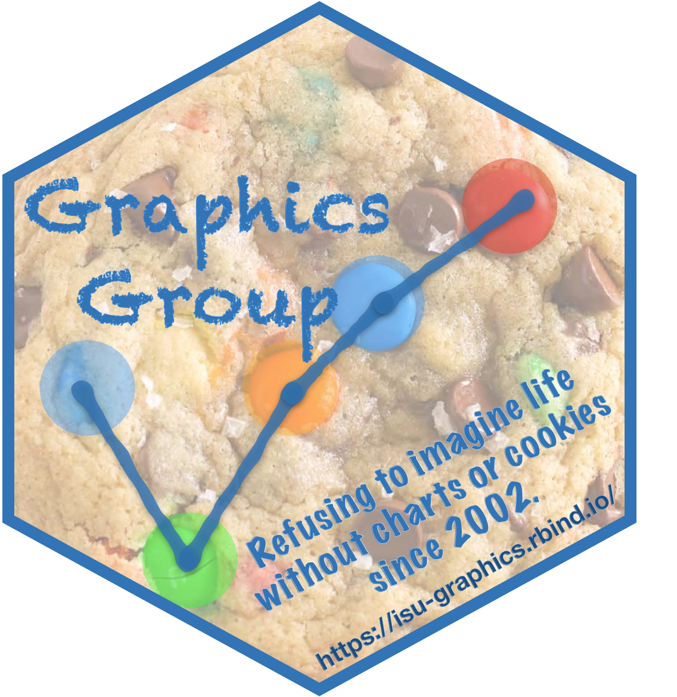
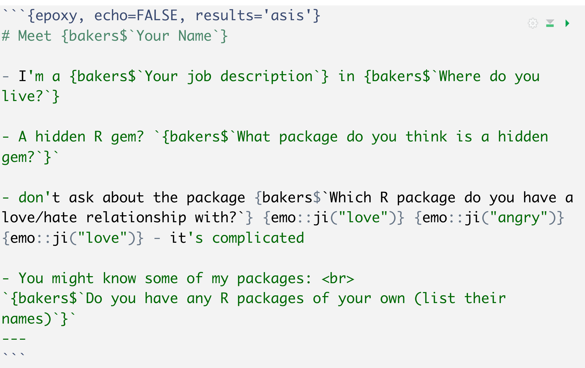

```{r setup, include=FALSE}
options(htmltools.dir.version = FALSE)
```

```{r packages, include = FALSE, message=FALSE, warning=FALSE}
library(tidyverse)
library(epoxy) # remotes::install_github("gadenbuie/epoxy")
library(glue) 
library(readxl)
```

```{r data, echo=FALSE}
xlsx <- "~/Downloads/Who RRR you_(1-22).xlsx"
bakers <- read_xlsx(xlsx)
bakers <- bakers %>% sample_n(size=nrow(bakers), replace = FALSE)
bakers <- bakers %>% rename(
  rpackages = `Do you have any R packages of your own (list their names)`
) %>% mutate(
  rpackages = ifelse(is.na(rpackages), " ", rpackages)
)
  
```

class: inverse, center, middle
# Welcome!

---

# The Plan for Today
.pull-left[
- Introduce ourselves to each other

- Talk about some R packages
]
.pull-right[
.center[]
Allison Horst  https://allisonhorst.com/
]

--

- and eat pizza!


---

# Today's slides

- made from `glue`d together data

  - you provided the data
  
  - I `glue`d them together 

- similar to Allison Hill's Valentine's Card approach 

<br>
<br>
<br>
<br>

<br>
<br>
<br>
<br>
<small>
link of Allison Hill's talk at the R Cleveland Group from 3/24/2021  https://www.youtube.com/watch?v=sxYE0BY1mdc&t=2868s
</small>

---

# Graphics & Numbats Crossover

.pull-left[
### Monash NUMBATs 

Non-Uniform Monash Business Analytics Team

https://numbat.space/

.center[  ]

]

.pull-right[  
### Graphics Group

https://isu-graphics.rbind.io/

.center[  ]
]

---

# Meet the bakers

```{r echo=FALSE}
numbats <- bakers %>% filter(grepl("Melbourne", `Where do you live?`))
gg <- bakers %>% filter(!grepl("Melbourne", `Where do you live?`))
```

.pull-left[  
### NUMBATS

```{r echo=FALSE, results='asis'}
numbats %>%
  arrange(desc(`Where do you live?`)) %>%
  glue_data("- {`Your Name`}") %>%
  glue_collapse(sep= "\n")
```

.center[

]
]

.pull-right[  
### Graphics Group

```{r echo=FALSE, results='asis'}
gg %>%
  arrange(desc(`Where do you live?`)) %>%
  glue_data("- {`Your Name`}") %>%
  glue_collapse(sep= "\n")
```

<small>You are on here, if you filled out the survey at: https://forms.office.com/r/VVHtf569LZ
</small>
]
---


```{epoxy recipe}
# Meet {bakers$`Your Name`}

- I'm a {bakers$`Your job description`} in {bakers$`Where do you live?`} 

- A hidden R gem? `{bakers$`What package do you think is a hidden gem?`}` 

- don't ask about the package {bakers$`Which R package do you have a love/hate relationship with?`} {emo::ji("love")} {emo::ji("angry")} {emo::ji("love")} - it's complicated 

- You might know some of my packages: <br>
`{bakers$rpackages}` 
---
```

---

# The Recipe 




